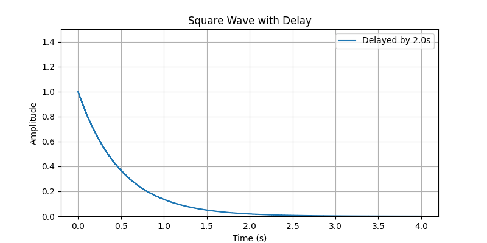
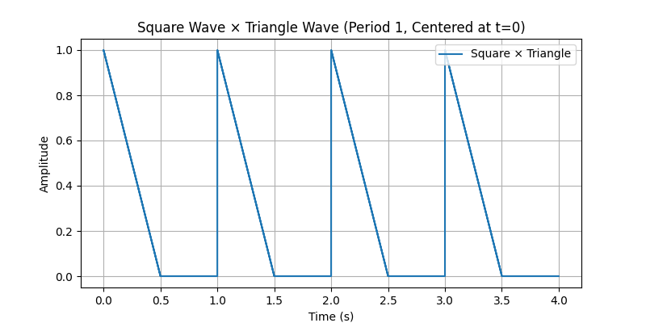
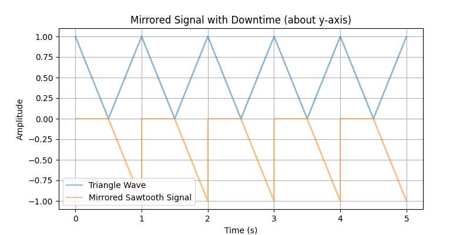
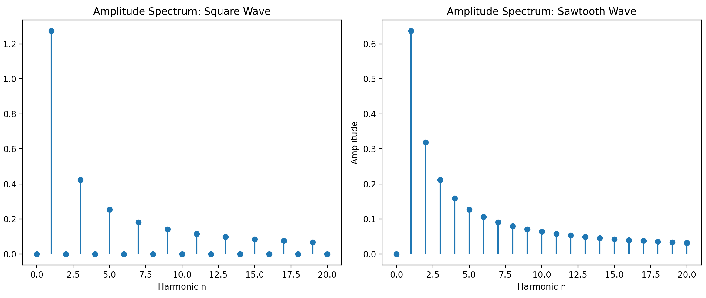

# DSP Exercise 1

## Task 1

### 1.1



### 1.2
The integral of the signal is finite and square integrable. It is therefore 

### 1.3

$$
E_x = \int_{-\infty}^{\infty}s^2(t) = \int_{0}^{4} (e^{-2t})^2 = \int_{0}^{4} e^{-4t} \\ 


= \left[-\frac{1}{4}e^{-4t} \right]_{0}^{4} = \underline{\underline{\frac{1}{4}(1-e^{-16})
}}
$$

### 1.4


$$
z(t) = -s(-t) = -\Pi\left(\frac{-t-2}{4}\right)e^{2t}
$$
.png)

$$
v(t) = s(t+4) = \Pi\left(\frac{t+2}{4}\right)e^{-(2t+8)}
$$
.png)


Code used for visualization:
```
import numpy as np
import matplotlib.pyplot as plt

# Parameters
T = 4.0  # period in seconds
t_max = 4.0  # total time to plot
dt = 0.001  # time step
delay = 2.0  # delay in seconds

# Time vector
t = np.arange(0, t_max, dt)


# Delayed square wave: shift time by 'delay'
y_delayed = np.where((((t + 4) - delay) - 2 % T) < (T / 2), 1, 0) * np.exp(-2 * (t + 4))

# Plot
plt.figure(figsize=(8, 4))
# plt.step(t, y, where="post", label="Original")
plt.step(t, y_delayed, where="post", label=f"Delayed by {delay}s")
plt.xlabel("Time (s)")
plt.ylabel("Amplitude")
plt.title("v(t) = s(t+4)")
# plt.ylim(0, 1.5)
plt.grid(True)
plt.legend()
plt.show()

```

## Task 2

### 2.1


$$
E_x = \int_{-\infty}^{\infty}x(t) = \infty
$$

Given $x(t)$ one could express the wave as a symmetrical triangular wave subtracted with the sawtooth signal $x(t)$

$$
Q(t) = \Lambda\left(\frac{t}{1}\right)-x(-t)
$$




## Task 3

### 3.1

The fourier series of a square wave with return to 0 can be computed by:

$$
f(t) = \frac{a_0}{2}+ \sum_{n=1}^\infty (a_n \cos(\frac{n\pi t}{T_0}) + b_n \sin(\frac{n\pi t}{T_0}))
$$

Given that the square wave with return to zero is and even function, i.e. $f(t) = f(-t)$ the formula simplifies due to $b_n = 0, \forall~n$. 

Furthermore $a_0$ (the DC component/average value of the function), and $a_n$ are given by:

$$
a_0 = \frac{2}{T_0}\int_{-T_0/2}^{T_0/2}f(t)~dt,~\land~ a_n = \frac{2}{T_0} \int_{-T_0/2}^{T_0/2}f(t)\cos(\frac{2\pi n t}{T_0})~dt
$$

With a square wave with a pulse duration $T$ and a period $T_0 > T$, $a_0$ can be computed (assuming that the amplitude is $1$ and that it is centered in $t=0$) by:

$$
\frac{a_0}{2} = \frac{T \cdot height}{T_0} = \frac{T}{T_0}
$$

Whereas the AC component(s) can be evaluated by:

$$
a_n = \frac{2}{T_0} \int_{-T/2}^{T/2}\cos(\frac{2\pi n}{T_0}t), \text{ since $f(t) \neq 0$ only for $t \in [-T/2,T/2]$} 
$$

$$
a_n = \frac{2}{T_0}\left[\frac{T_0}{2\pi n}\sin(\frac{2\pi n}{T_0}t)\right]_{-T/2}^{T/2} = \frac{2}{T_0}\cdot\left(\frac{T_0}{2\pi n}\sin(\frac{\pi n T}{T_0})--\frac{T_0}{2\pi n}\sin(\frac{\pi n T}{T_0})\right)
$$

$$
a_n = \frac{2}{T_0}\left(\frac{2T_0}{2\pi n}\sin(\frac{\pi n T}{T_0})\right) = \underline{\frac{2}{\pi n}\sin(\frac{\pi n T}{T_0})}
$$

Therefore leaving us with the fourier series defined by:

$$
f(t) = \frac{T}{T_0} + \sum_{n=1}^{\infty}\frac{2}{\pi n}\sin(\frac{\pi n T}{T_0})\cos(\frac{2\pi n }{T_0}t)
$$

With any arbitrary amplitude the function becomes:

$$
f(t) = \frac{AT}{T_0} + \sum_{n=1}^{\infty}\frac{2A}{\pi n}\sin(\frac{\pi n T}{T_0})\cos(\frac{2\pi n }{T_0}t)
$$


### 3.2
For a sawtooth wave given by $f(t) = \frac{A}{T_0}t,~\land~ f(t + T_0) = f(t),~\forall ~t$ with period $T_0$ we have:

$$
a_0 = \frac{1}{T_0}\int_{0}^{T_0}f(t)~dt = \frac{1}{T_0}\int_{0}^{T_0}\frac{At}{T_0}~dt = \frac{1}{T_0}\left[\frac{At^2}{2T_0}\right]_{0}^{T_0} = \frac{A}{2} \to \underline{\frac{a_0}{2}= \frac{A}{4}}
$$

And for the cosine coefficients:

$$
a_n = \frac{2}{T}\int_{0}^{T_0}\frac{At}{T_0}\cos(\frac{2\pi n}{T_0}t)~dt = \frac{2A}{T_0^2}\int_0^{T_0}t\cos(\frac{2\pi n}{T_0}t)~dt 
$$

$$
= \left[t\frac{T_0}{2\pi n}\sin(\frac{2\pi n}{T_0}t)\right]_{0}^{T_0}-(\frac{T_0}{2\pi n})^2\cos(\frac{2\pi n}{T_0}T_0) = \underline{0}
$$

And then finally for the sine coefficients the integration is almost the same (i.e. integration by parts) where the result comes out to:

$$
b_n = \frac{-A}{\pi n}
$$

The resulting fourier series then comes out to:

$$
f(t) = \frac{A}{4} -\frac{A}{\pi} \sum_{n=1}^{\infty}\frac{1}{n}\sin(\frac{2\pi n}{T_0}t)
$$

### 3.3
